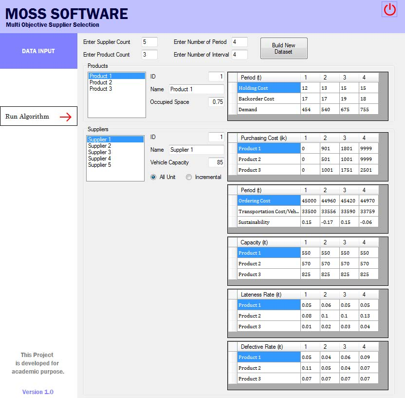
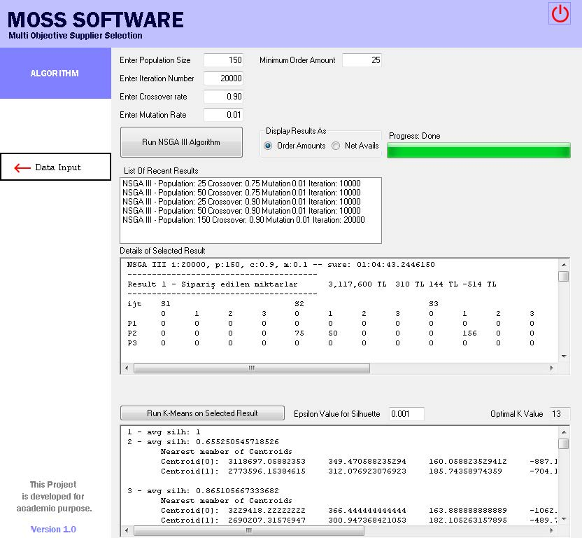
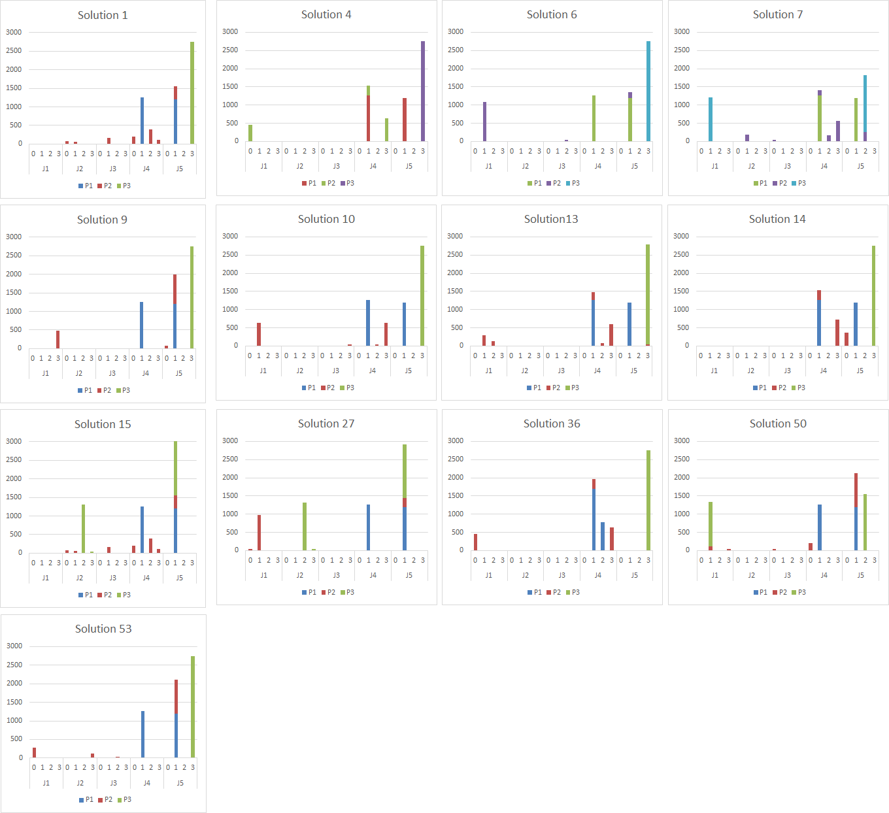

# MOSS
Multiobjective Supplier Selection Software 

This project is a part of the article https://journals.sfu.ca/ijietap/index.php/ijie/article/view/5903

MOSS SOFTWARE: A NEW TOOL FOR MULTI-OBJECTIVE GREEN SUPPLIER SELECTION

    Peral Toktas-Palut
    Doğuş University
    http://orcid.org/0000-0002-8864-0904

    Kıvanç Onan
    Department of Computer Engineering, Doğuş University, İstanbul, Turkey

    Mustafa Zahid Gürbüz
    Department of Computer Engineering, Doğuş University, İstanbul, Turkey

    Birsen Gülden-Özdemir
    Department of Computer Engineering, Doğuş University, İstanbul, Turkey

DOI: https://doi.org/10.23055/ijietap.2022.29.2.5903

 ## ABSTRACT
Competition between companies is getting more intense by the day. Corporations need to decrease costs while improving the quality and reliability of their deliveries. Meanwhile, the demand for environmentally sustainable products and operations is increasing. These issues are all compounded by the supplier relations between companies and their need to develop better economic and environmental supply chain contracts. This research thus aims to propose a tool, i.e., the MOSS Software, concerning the total cost, rate of defected materials, rate of late deliveries, and environmental improvement potential for suppliers. MOSS is a two-stage software. First, the objectives are included in a multi-objective evolutionary mathematical model, and the model is solved using the NSGA-III algorithm. In the second stage, as a post-Pareto analysis approach, the k-means algorithm is used for selecting representative solutions among Pareto sets by comparing silhouette values for different k values. An application of the MOSS software is also presented in this paper.

**Keywords:** Green supplier selection, Lot sizing, Quantity discount, Multi-objective optimization, Genetic algorithm, k-means clustering algorithm

*Figure 2. MOSS first stage; data table generation and data entry*

*Figure 5. MOSS second stage; solution and post Pareto analysis*

*Solutions*

